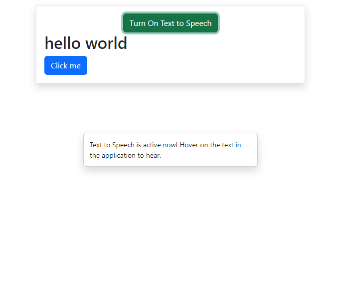

# React Text to Speech

### Live Demo - [https://react-text-to-speech-swart.vercel.app/](https://react-text-to-speech-swart.vercel.app/)

- Text to Speech feature should be implemented for accessibility purposes.
- Here the Web Speech API is used to implement the text-to-speech functionality.

## References
- [https://edvins.io/react-text-to-speech](https://edvins.io/react-text-to-speech)
- [Add text to speech to every text node to website built with React](https://stackoverflow.com/questions/73425985/add-text-to-speech-to-every-text-node-to-website-built-with-react)
- [Example website with the functionality](https://www.monshaat.gov.sa/en)
- [Getting Started with Accessibility for React](https://www.telerik.com/blogs/getting-started-accessibility-react)
